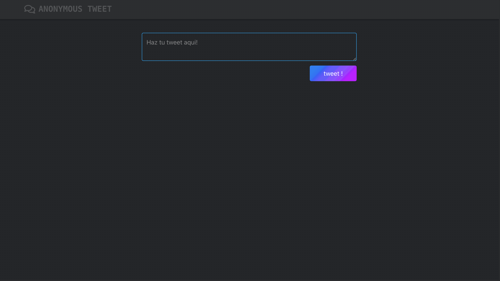

# Anon Twitter

[](https://lerna.js.org/)

A Monorepo of a web app where you can share your tweets Anonymously. \
it is a project created for make a workshop of Kubernetes. \

Monorepo boostraped using lernajs, also you can run this project using docker and docker compose

## Installing and running

```shell
npx lerna bootstrap
npm run dev
```

Also you can run the project using docker and docker compose

```shell
docker-compose build --force-rm &&
docker-compose up -d
```



---

### Used Stack and Tools

- JavaScript
- React
- Inline Styles
- Bulma
- express
- sequelize
- sqlite
- docker
- docker-compose
- lerna
